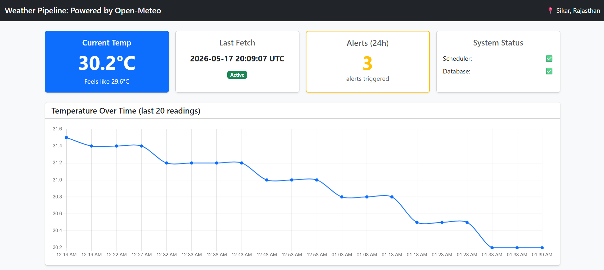
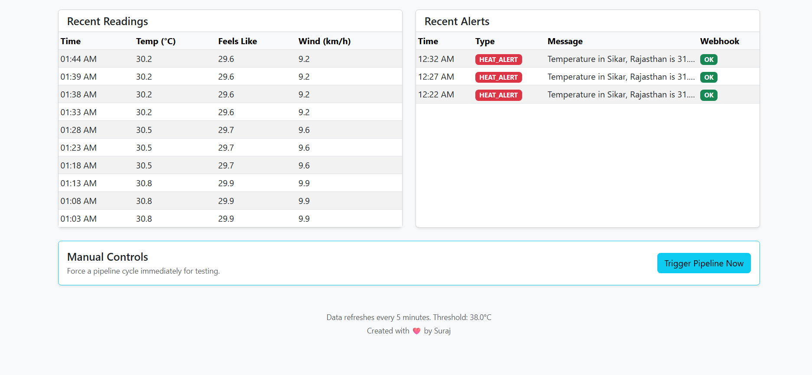
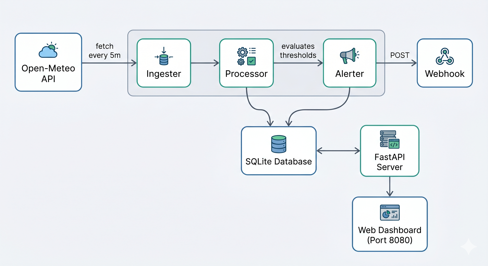

# Event-Driven Weather Data Pipeline

  
 

## 📖 Problem Statement
The objective is to build a lightweight, automated, event-driven data pipeline using entirely free and open-source tools. The system must automatically collect real-time public data, process it for specific conditions or anomalies, and trigger alerts when those conditions are met. It must be fully containerized, highly reliable, and easily verified by another engineering team.

## 💡 The Solution
This project is an end-to-end automated pipeline that monitors weather conditions in real-time. It fetches data from the Open-Meteo API every 5 minutes and evaluates it against custom thresholds. If the weather becomes dangerously hot or spikes rapidly, it instantly fires an external webhook alert. 

To ensure complete visibility, the system features a built-in **Real-Time Dashboard** that tracks temperature trends, recent database readings, system health, and a history of triggered alerts.

## 🏗️ System Architecture



## ⚙️ How It Works (Data Flow)
1. **Ingester**: A background service that fetches current weather data (Temp, Wind, Conditions) from the Open-Meteo API on a recurring schedule.
2. **Processor**: Evaluates the incoming data against defined rules:
   - **HEAT_ALERT**: If temperature crosses the defined `TEMP_ALERT_THRESHOLD` (e.g., 38.0°C).
   - **RAPID_RISE**: If the temperature suddenly rises by >= 3.0°C since the last reading.
3. **Database**: Persists the raw readings and any triggered alerts locally into an embedded SQLite database.
4. **Alerter**: If a condition is met, an alert payload is immediately POSTed to the configured Webhook endpoint (e.g., webhook.site).
5. **Dashboard**: A FastAPI web server exposes the SQLite database to a live, auto-refreshing UI using Chart.js and Bootstrap.

## 🛠️ Tech Stack
- **Backend:** Python 3.11, FastAPI, Uvicorn
- **Scheduling:** APScheduler
- **HTTP Client:** HTTPX
- **Database:** SQLite3 (Built-in, zero-config)
- **Frontend:** Jinja2, Bootstrap 5, Chart.js
- **DevOps:** Docker, Docker Compose

---

## 🚀 Quick Start

**Step 1:** Clone this repository to your local machine.

**Step 2:** Generate a free test webhook URL.
Go to [webhook.site](https://webhook.site/) and copy Your Unique URL.

**Step 3:** Configure your environment.
```bash
cp .env.example .env
```
Open the `.env` file and paste your unique URL into the `WEBHOOK_URL` variable.

**Step 4:** Run the application using Docker Compose.
```bash
docker-compose up --build
```

**Step 5:** View the Dashboard.
Open your browser and navigate to: **[http://localhost:8080](http://localhost:8080)**

---

## 🧪 Testing and Verification

### Force an Alert
To easily test the alerting mechanism:
1. Open `.env` and set `TEMP_ALERT_THRESHOLD=15.0`.
2. Restart the container: `docker-compose restart`.
3. The alert will fire immediately on startup. Check your [webhook.site](https://webhook.site/) tab for the incoming POST request, and view the dashboard's "Recent Alerts" table.

### Manual Pipeline Trigger
Instead of waiting 5 minutes for the scheduler, you can manually force a data cycle:
- Click the **"Trigger Pipeline Now"** button at the bottom of the web dashboard.
- OR run: `curl -X POST http://localhost:8080/trigger-now`

### System Health
You can verify the scheduler and database are actively running by:
- Looking at the "System Status" card on the dashboard.
- Accessing the JSON health endpoint: `curl http://localhost:8080/health`
- Watching the container logs: `docker-compose logs -f`

---

## 📁 Project Structure
```text
pipeline/
├── src/
│   ├── __init__.py       # Package initializer
│   ├── ingester.py       # Fetches weather from Open-Meteo API
│   ├── processor.py      # Checks if alert conditions are met
│   ├── alerter.py        # Sends webhook POST on alert
│   ├── database.py       # SQLite setup and queries
│   ├── scheduler.py      # APScheduler recurring job
│   └── api.py            # FastAPI routes + Jinja2 HTML dashboard
├── templates/
│   └── dashboard.html    # Main HTML page with Bootstrap + Chart.js
├── logs/                 # Stores rotating system logs (mounted)
├── data/                 # Stores the SQLite database file (mounted)
├── main.py               # Application Entry Point
├── config.py             # Environment configuration loader
├── Dockerfile            # Container definition
├── docker-compose.yml    # Service orchestration
├── requirements.txt      # Python dependencies
└── .env.example          # Environment variables template
```
